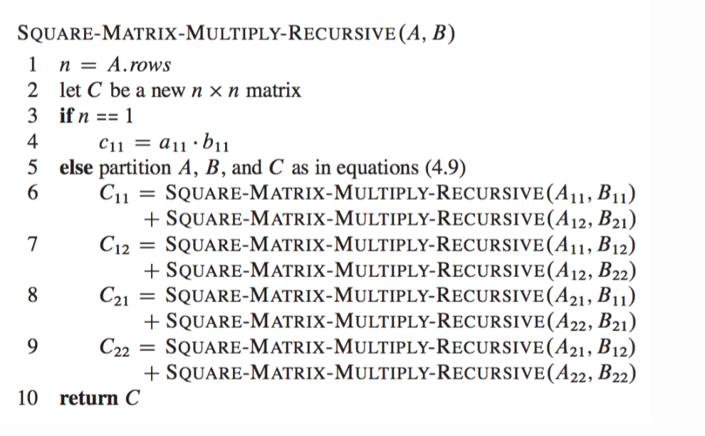
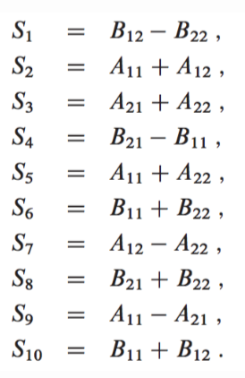
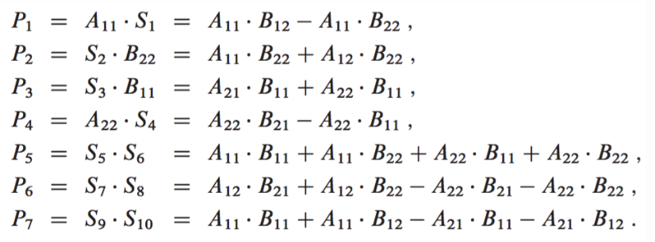
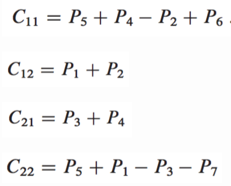

## Context Free Language

프로그램의 몇몇 성질들은 정규 언어 이상의 어떤 것을 필요로 한다. 따라서 중첩 구조와 그 외의 다른 좀더 복잡한 특성들을 표현하려면, 언어군을 확대하여야 한다.<sup>1</sup>
프로그래밍 언어는 문맥-자유 언어로 잘 표현될 수 있는 여러 특성을 가지고 있다.
Every regular language is context free. But not all context free language is regular.

context free language : language generated by some context free grammer.
The set of all CFL is identical to the set of languages accepted by Pushdown Automata.

Context Free Grammer G = {V, Σ, S, P} where
V = Set of variables or Non-Terminal Symbols
Σ = Set of Terminal Symbols
S = Start Symbol
P = Production Rule ( A -> ⍺, where ⍺ = {V ∪ Σ}* and A ⊆ V)

Ex) generating a language that in the form of aⁿbⁿ : G = {(S,A), (a,b), (S->aAb, A->aAb|ϵ)} <sup>2</sup>
S -> aAb
   -> aaAbb (by A -> aAb)
   -> aaaAbbb (by A -> aAb)
   -> aaabbb (by A -> ϵ)
   -> aⁿbⁿ, n=3


### General Context-Free Recognition in Less than Cubic Time^3^

: An algorithm for general context-free recognition is given that requires less than n<sup>3</sup> time asymptotically for input strings of length n, using Strassen's method for matrix multiplication.

1. Strassen's Algorithm : 독일의 수학자 폴커 슈트라센이 1969년에 개발한 행렬 곱셈 알고리즘. 정의에 따라 n x n 크기의 두 행렬을 곱하면 O(n<sup>3</sup>)의 시간이 소요되지만 이 알고리즘은 대략 O(n^2.8^)의 시간이 소요된다.<sup>4</sup> 


#### Naive O(n<sup>3</sup>) Algorithm
```python
def multiply(mat_a, mat_b):
    n = len(mat_a)
    
    mat_c = [[0 for x in range(n)] for y in range(n)] 
    for i in range(n):
        for j in range(n):
            for k in range(n):
                mat_c[i][j] += mat_a[i][k]*mat_b[k][j]
    
    return mat_c
```


#### Divide And Conquer Algorithm

1) Divide matrices A and B in 4 sub-matrices of size N/2 x N/2
[[a,b],[c,d]] x [[e,f],[g,h]]
2) Calculate recursively : ae+bg, af+bh, ce+dg, cf+dh
= **8 multiplications, 4 additions** - addition of 2 matrices takes O(N<sup>2</sup>)
T(N) = 8T(N/2) + O(N<sup>2</sup>) = O(N<sup>3</sup>)



Ref: https://shivathudi.github.io/jekyll/update/2017/06/15/matr-mult.html

#### Strassen's Algorithm

Use the same divide and conquer approach as above, but uses only 7 recursive calls rather than 8. And reduce the runtime complexity to sub-cubic time <sup>5</sup>.
1) Divide the input matrices A and B into N/2 x N/2 submatricies. - O(1) by index calculations
2) Create 10 matrices S<sub>1</sub>, S<sub>2</sub>, ... S<sub>10</sub> each of which is the sum or difference of two matrices created in step 1. - O(n<sup>2</sup>)


3) Recursively compute seven matrix products P<sub>1</sub>, P<sub>2</sub>, .. P<sub>7</sub>. Each matrix P<sub>i</sub> is of size N/2 x N/2. 


4) Get the desired submatricies C<sub>11</sub>, C<sub>12</sub>, C<sub>21</sub>, C<sub>22</sub> by adding and subtracting various combinations of the P<sub>i</sub> submatrices. These can be computed in O(n<sup>2</sup>) time.


T(n) = Θ(1) if n = 1,
​	  7T(n/2) + Θ(n<sup>2</sup>) if n>1
O(n<sup>log<sub>b</sub>a</sup>) = O(n<sup>log<sub>2</sub>7</sup>) = O(n<sup>2.81</sup>)

2. Every context-free grammer can be transformed into an equivalent one in Chomsky normal form. 
   = Theorem : Every context-free language can be generated by a grammer in Chomsky normal form.<sup>6</sup>

   Chomsky Normal Form : A -> NT<sub>1</sub>, NT<sub>2</sub> (two non-terminal symbols)
   or A -> ⍺ (single terminal symbol)
   can not A(non-terminal) -> ϵ, unless A is start variable.

   ex) Given a CFG G, convert it to Chomsky normal form.
   S -> ASA | aB
   A -> B|S
   B -> b|ϵ

   - start symbol can only appear on left side, so add new start symbol S<sub>0</sub> -> S
     S -> ASA | aB
     A -> B|S
     B -> b|ϵ
   - terminal variables = a, b because all other variables appear on the left side.
     Need to remove B-> b|ϵ and apply possible changes
     S<sub>0</sub> -> S
     S -> ASA | aB | a
     A -> B|S|ϵ
     B -> b
   - Remove A -> ϵ
     S<sub>0</sub> -> S
     S -> ASA | aB | a | SA | AS | S
     A -> B|S
     B -> b
   - Remove unit rules (non-terminal) -> (non-terminal)


   ex) cannot have A(non-terminal)->ϵ, unless A is start variable
   B -> BC**A**CB**A**B
   4 possible cases (A<sub>1</sub> -> ϵ, A<sub>2</sub> -> ϵ, A<sub>1</sub>,A<sub>2</sub> -> ϵ, or neither)
   B -> BCCBAB
   B -> BCACBB
   B -> BCCBB
   B -> BCACBAB


1) 형식 언어와 오토마타 : Peter Linz 저서, 장직현. 김응모. 엄영익. 한광록 공역, 사이텍미디어, 2001 (원서 : An Introduction to Formal Languages and Automata. 3rd ed, Jones and Bartlett. 2001), Page 133~158
2) https://www.youtube.com/watch?v=5_tfVe7ED3g&index=65&list=PLBlnK6fEyqRgp46KUv4ZY69yXmpwKOIev
3) Valiant, Leslie G. "General context-free recognition in less than cubic time." *Journal of computer and system sciences*10.2 (1975): 308-315.
4) https://ko.wikipedia.org/wiki/%EC%8A%88%ED%8A%B8%EB%9D%BC%EC%84%BC_%EC%95%8C%EA%B3%A0%EB%A6%AC%EC%A6%98
5) https://shivathudi.github.io/jekyll/update/2017/06/15/matr-mult.html
6) https://www.youtube.com/watch?v=IiCbNhHwsws